# Detailed Design Document

| **Author**              | `Tarek Mahmoud Younes`                               |
|:------------------------|:-----------------------------------------------------|
| **Status**              | `Draft`                                              |
| **Version**             | `1.0.0`                                              |
| **Date**                | `01/05/2005`                                         |

## Introduction

This document explains the low-level design for the UART Control and Monitoring Module (UCM v1.0), an embedded system component within the "Data Acquisition Over Network Project." The UCM is responsible for serial command reception to actuate an external LED and the periodic transmission of status signals derived from a monitored push button.

### Purpose
The purpose of this detailed document is to define the implementation strategy, internal architecture, and public interfaces for the UCM firmware module. This definition is important for guiding in the development process and facilitating both hardware and software implementation.

### Scope
This document scopes the Software Design of the UCM firmware, specifically detailing the logic for the UART driver, the digial input/output handling for the led and push button, and the embedded communication protocols. This scope does not cover the electrical design or schematic of the hardware (which is documented separately), but rather defines the software interfaces used to interact with the target Microcontroller Unit (MCU) peripherals.

## Architectural Overview

### Assumptions & Constraints

```plantuml
@startuml
package "Assumptions & Constraints" {
    package "Assumptions"{
  
    [UART commands always end with 'x']
    [Push button connected in pulldown]
    [Command length ≤ 20 characters] 
    [led connected to a single pin]
    [single command at a atime]
    [debounce delay is sufficient]
}
    package "Constraints"{
    [UART baud rate fixed to 9600]
    [limited feedback data: no time, location,...]
    [Button must be debounced]
    [UART buffer limited to 20 bytes]
    [UART baud rate = 9600]
    [only one led and one push button controlled]
    }
}
@enduml
```

## Functional Description
The following sections describe software functionality covering all sides of informaiton

### Inputs/Outputs
Push Button: connected to PD4 (input) using a pull down resistor.
LED: connected to PD7 (output)

### Functionlity
1/The module contineously reads serial UART commands and push button state. 
2/ When a valid command ends with 'x' it is processed:
  led_on: turns led on, with a message "led_on".
  led_off: turns led off, with a message "led_off"
  any other command: no led status change, with a message "Invalid_Input".
3/ Push Button state changes process a message over UART:
  value=1: button_pressed
  value=0: button_released

## Implementation of the Module
After Hardware Communication:

#### Software
1/ UART Initialization: setting baud rate to 9600, enabling transmitter, receiver and enabling receiver interrupt for non blocking reception.
2/ UART ISR (Interrupt Service Routine): Receives characters, stores them in the buffer, and sets a flag (UartCommandReady) when 'x' is received.
3/ LED Control Function: checks UartCommandReady, compares the received string using strcmp, and takes action according to its result. then clears buffer and resets index of the buffer. 
4/ Push Button Function: detects state change, take action according to the result. 
5/ main loop in final_app: initialize Uart, LED pin, and button pen. Then contineously checks UartCommandReady for led control and checks button state change.
### Notes
1/ Debouncing: _delay_ms(100) to prevent button bouncing.
2/ Buffer Handling: ensures no overflow in uart receive buffer.
3/ Extend to bigger scale: Additional leds and buttons can be added by expanding LedControl and PushButtonSignal.

### Static Files
The UCM module consists of the following arduino and header files:

| File name     | Contents                                                                     |
|---------------|------------------------------------------------------------------------------|
| Uart.ino      | UART used-defined functions                                                  |
| Uart.h        | The header file of the UART functions that includes declarations             |
| dio.ino       | The two functions of led control and push button monitoring                  |
| dio.h         | The declaration file of digital input output file of the led and push button |
| final_app.ino | Integrating all codes in one file according to the system function           |

### Include Structure

### Configuration
The following parameters must be define according to the user case and situation.
| Name         |Value range| Description                                                                    |
|--------------|-----------|--------------------------------------------------------------------------------|
|F_CPU         |16000000UL |The frequency of the MCU used for baud rate calculation                         |
|BaudRate      |   9600    |The fixed baud rate for serial UART communication                               |
|CmdBufferSize |     20    |The maximum size for the incoming UART command buffer                           |
|LedPosition   |     7     |The Pin used for led control on PORTD                                           |
|ButtonPosition|     4     |The pin used for button monitoring on PORTD                                     |
|DebounceDelay |    100    |The delay (in milliseconds) applied after button state change to counter bounce |

